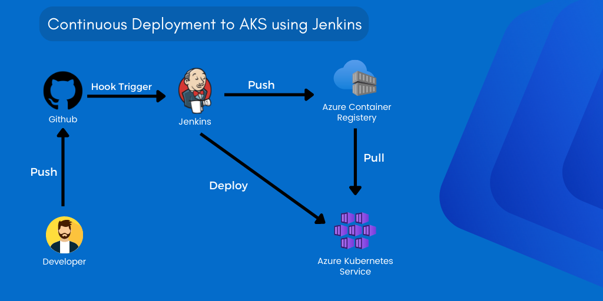

# Deploy a Web Application to a Kubernetes Cluster on Azure
 This project will use Jenkins and Terraform to create a CI/CD pipeline to test and deploy a web application to a Kubernetes cluster on Azure. We will use Jenkins to perform automated testing on the application and create builds for deployment.
 
 Terraform will be used to create the Kubernetes cluster on Azure and configure the necessary resources to enable the deployment of the application. We will also use Terraform to configure the necessary security settings to ensure the application is secure.
 
 Once the pipeline is complete, we will be able to deploy the application to our Kubernetes cluster with minimal effort and ensure that it is running as expected.

